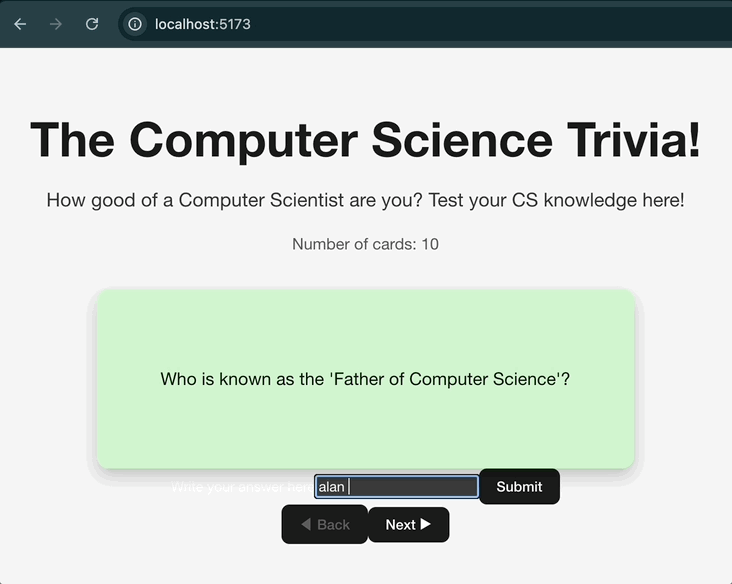

# Web Development Project 3 – The Ultimate CS Trivia Flashcards with user input

Submitted by: **Md Rakibul Hasan**

This web app: **An interactive flashcard application that quizzes you on CS trivia, letting you flip a card to reveal the answer and hit “Next” for a random new card. It will show you if your answer is correct or incorrect**

Time spent: **5 hours** spent in total

## Required Features

The following **required** functionality is completed:

- [x] **The app displays the title of the card set, a short description, and the total number of cards**
  - [x] Title of card set is displayed  
  - [x] A short description of the card set is displayed  
  - [x] A list of card pairs is created  
  - [x] The total number of cards in the set is displayed  
  - [x] Card set is represented as an array of objects (`{ question, answer }`)
- [x] **Pre-Flip Guess Input**
  - [x] A clearly labeled input field and Submit button allow users to enter their guess before viewing the answer.
  - [x] Incorrect submissions trigger visual feedback indicating the guess was wrong.
  - [x] Correct submissions trigger visual feedback indicating the guess was right.
- [x] **A single card at a time is displayed**
  - [x] Only one half of the information pair is visible at once
- [x] **Clicking on the card flips it over, showing the corresponding component of the information pair**
  - [x] Clicking the card reveals the back (answer)  
  - [x] Clicking again flips it back to the front (question)
- [x] **Sequential Card Navigation**
  - [x] Next ▶ button advances to the next card in order.
  - [x] ◀ Back button returns to the previous card.
  - [x] Navigation buttons are disabled (and visually dimmed) when at the first or last card to prevent wrap‑around.

## Additional Features

- [X] *None at this time*

## Video Walkthrough

Here's a walkthrough of implemented required features:




## Notes

- **3D flip styling** took extra effort: had to split into front/back faces and handle `backface-visibility`.  
- **Planty design**: balancing a translucent green overlay on a subtle botanical background to keep text readable.  
- **Randomization logic**: ensured “Next” never returns the same card twice in a row.

## License

```text
Copyright 2025 Md Rakibul Hasan

Licensed under the Apache License, Version 2.0 (the "License");
you may not use this file except in compliance with the License.
You may obtain a copy of the License at

    http://www.apache.org/licenses/LICENSE-2.0

Unless required by applicable law or agreed to in writing, software
distributed under the License is distributed on an "AS IS" BASIS,
WITHOUT WARRANTIES OR CONDITIONS OF ANY KIND, either express or implied.
See the License for the specific language governing permissions and
limitations under the License.
